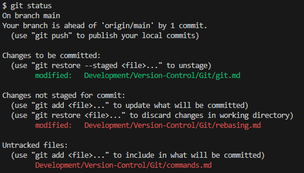

# Common Git Commands

A brief overview of commonly used git commands.

## Status - `git status`
Show the current status of the repository, including the current branch, staged, unstaged and untracked files, as well as other useful information.

## Stage - `git add`
Add files to the index. Indexed files will be commited when using `git commit`.

Use `git add .` in the repository root to add all changes to the index.

## Commit - `git commit`
Create a new commit using all staged files. Use the `-m` option to add a commit message directly.